# DeepLearning

[TOC]

## 1. 题目

1.1 搭建Tensorflow

1.2 参考《Tensorflow实战》完成以下题目

- 简单CNN对MNIST手写体的数字识别
- AlexNet
- VGGNet
- GoogLeNet
- ResNet
- LSTM

1.3 应用
目的：训练学生利用平台和算法，完成具体事务。
要求：完成演示Demo
内容：
（1） 针对文本的分类
（2） 运动目标检测
（3） 运动目标识别


## 2. 算法阐述或实验步骤说明

### 2.1 环境搭建

- 系统环境

Ubuntu18.04

- 编译器

vscode

#### 2.1.1 安装anaconda

1. 在[清华镜像站](https://mirrors.tuna.tsinghua.edu.cn/anaconda/archive/)下载Anaconda3-5.3.1-Linux-x86_64.sh
2. 进入下载文件夹运行`bash Anaconda3-5.3.1-Linux-x86_64.sh `
3. 全程默认安装，安装完成后输入`conda -V`查看conda版本

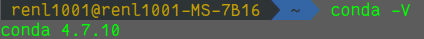

4. 切换清华源 

   ```bash
   conda config --add channels https://mirrors.tuna.tsinghua.edu.cn/anaconda/pkgs/free/
   conda config --add channels https://mirrors.tuna.tsinghua.edu.cn/anaconda/pkgs/main/
   conda config --set show_channel_urls yes
   ```

#### 2.1.2 创建虚拟环境

1. 利用conda创建tensorflow虚拟环境，python版本为3.6 `conda create -n tensorflow-gpu python=3.6`此时会创建一个新的python环境，包含一些基础的包，能够将不同的环境隔离开来。

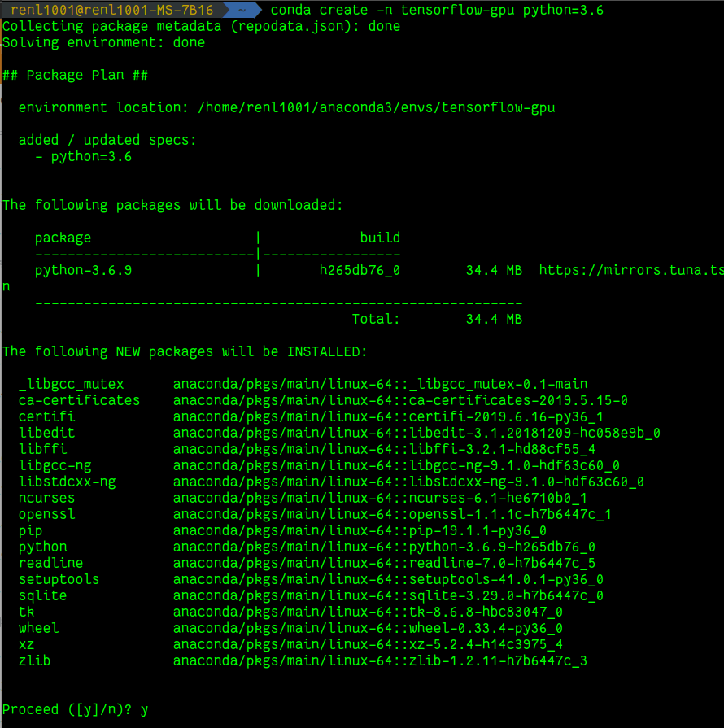

2. 切换为虚拟环境 `source activate tensorflow-gpu`

#### 2.1.3 安装tensorflow

`conda install tensorflow-gpu=1.0` 通过conda可以直接安装带gpu版本的tensorflow1.0，安装过程conda会根据tensorflow的版本，来选择cudatoolkit和cudnn的版本并安装。（安装cpu版本只需要将命令改成`conda install tensorflow-cpu=1.0`即可。

安装结束后利用`conda list`查看已有的包：

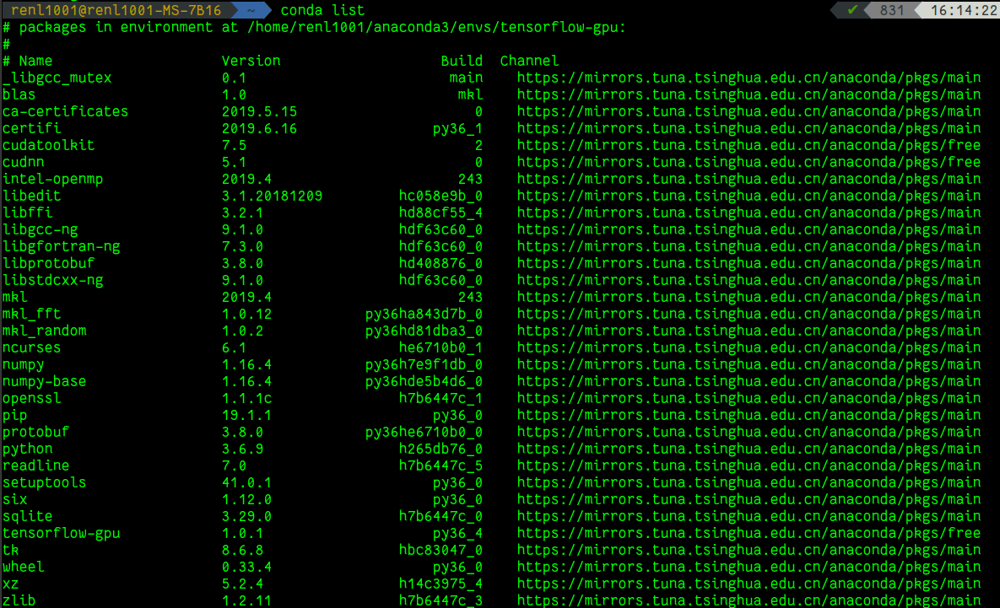

可以看到已经安装好了tensorflow-gpu 1.0.1、cudatoolkit 7.5 和 cudnn 5.1

#### 2.1.4 测试是否安装成功

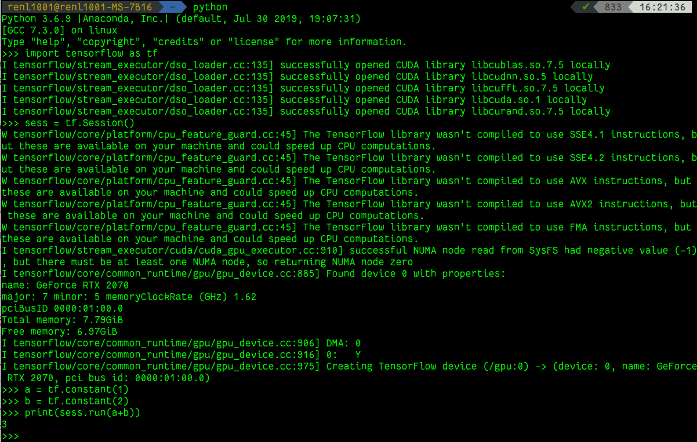

可以看到tensorflow已经安装成功，并且能够调用gpu。

### 2.2 简单CNN对MNIST手写体的数字识别

#### 2.2.1 数据准备

加载mnist数据集：

```python
from tensorflow.examples.tutorials.mnist import input_data

# 读取手写数字识别数据集
mnist = input_data.read_data_sets('MNIST_data', one_hot=True)
```

运行后会读取`./MNIST_data`文件夹中的数据，如果没有这个文件夹会自动下载。下载后的数据结构如下图：

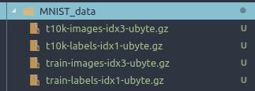

数据维度如下图：

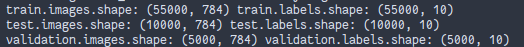

#### 2.2.2 算法流程

1. 创建网络

```python
# 第一层卷积
# 5*5*1*32
W_conv1 = weight_variable([5, 5, 1, 32])
b_conv1 = bias_variable([32])
# relu激活
h_conv1 = tf.nn.relu(conv2d(x_image, W_conv1) + b_conv1)
# 最大池化
h_pool1 = max_pool_2x2(h_conv1)  # 进行max-pooling

# 第二层卷积
W_conv2 = weight_variable([5, 5, 32, 64])
b_conv2 = bias_variable([64])
h_conv2 = tf.nn.relu(conv2d(h_pool1, W_conv2) + b_conv2)
h_pool2 = max_pool_2x2(h_conv2)

# 对两层卷积后的结果与预测值之间进行神经网络搭建
# 第一层
# 输入层有7*7*64个列的属性，全连接层有1024个隐藏神经元
W_fc1 = weight_variable([7 * 7 * 64, 1024])
# 1024个隐藏层节点偏值
b_fc1 = bias_variable([1024])

# 把池化层2的输出扁平化为1维，-1代表任意值
h_pool2_flat = tf.reshape(h_pool2, [-1, 7 * 7 * 64])
# 求第一个全连接层的输出，并激活
h_fc1 = tf.nn.relu(tf.matmul(h_pool2_flat, W_fc1) + b_fc1)
# Dropout处理，keep_prob用来表示处于激活状态的神经元比例
keep_prob = tf.placeholder(tf.float32)
h_fc1_drop = tf.nn.dropout(h_fc1, keep_prob)

# 第二层
# 输入为1024个隐藏层神经元，输出层为10个数字可能结果
W_fc2 = weight_variable([1024, 10])
b_fc2 = bias_variable([10])
# 将中间层与输出层10个结果全连接
y_conv = tf.nn.softmax(tf.matmul(h_fc1_drop, W_fc2) + b_fc2)
```

2. 创建损失函数和优化函数

```python
# 创建交叉熵损失函数
cross_entropy = tf.reduce_mean(
    -tf.reduce_sum(y_ * tf.log(y_conv), reduction_indices=[1]))
# 使用AdamOptimizer进行优化
train_step = tf.train.AdamOptimizer(1e-4).minimize(cross_entropy)
```

3. 训练

```python
# 计算准确率
correct_prediction = tf.equal(tf.argmax(y_conv, 1), tf.argmax(y_, 1))
accuracy = tf.reduce_mean(tf.cast(correct_prediction, tf.float32))

# 初始化全局变量
tf.global_variables_initializer().run()

# 循环20000次
for i in range(20000):
    batch = mnist.train.next_batch(50)
    if i % 100 == 0:
        train_accuracy = accuracy.eval(feed_dict={
            x: batch[0],
            y_: batch[1],
            keep_prob: 1.0
        })
        # 每100轮计算一次training acc
        print('step %d, training accuracy %g' % (i, train_accuracy))
    train_step.run(feed_dict={x: batch[0], y_: batch[1], keep_prob: 0.5})
```

#### 2.2.3 实验结果

通过20000次迭代训练，最终在mnist测试集上的准确率达到了 99.27%，部分训练截图如下：

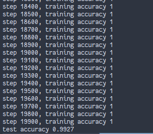

### 2.3 AlexNet

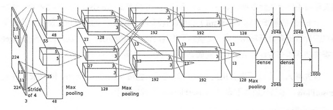

#### 2.3.1 数据准备

因为使用ImageNet数据集训练一个完整的AlexNet耗时非常长，这里只使用随机生成的图片数据来测试向前传播和向后传播的速度。

随机生成图片数据：

```python
# 图片大小为224*224*3
image_size = 224
# 随机初始化图片
images = tf.Variable(
    tf.random_normal([batch_size, image_size, image_size, 3],
                     stddev=1e-1,
                     dtype=tf.float32))
```


#### 2.3.2 网络模型

```python
def inference(images):
    # 用于存储卷积核数据和偏值数据
    parameters = []

    # 第一层卷积层
    with tf.name_scope('conv1') as scope:
        # 卷积核大小为11*11，通道数为3，数量为64
        kernel = tf.Variable(
            tf.truncated_normal([11, 11, 3, 64],
                                stddev=1e-1,
                                dtype=tf.float32,
                                name='weights'))
        # 卷积步长为4，padding值为SAME
        conv = tf.nn.conv2d(images, kernel, [1, 4, 4, 1], padding='SAME')
        # 偏值64个
        biases = tf.Variable(
            tf.constant(0.0, shape=[64], dtype=tf.float32, name='biaes'))
        # 卷积操作后，加上偏值
        bias = tf.nn.bias_add(conv, biases)

        # 用relu激活函数
        conv1 = tf.nn.relu(bias, name=scope)
        # 打印卷积数据状态
        print_activations(conv1)
        # 将卷积核和偏值数据存入参量集合
        parameters += [kernel, biases]
        # 使用LRN层对卷积数据进行处理
        lrn1 = tf.nn.lrn(conv1,
                         4,
                         bias=1.0,
                         alpha=0.001 / 9,
                         beta=0.75,
                         name='lrn1')
        # 采用3*3最大重叠池化，步长为2，小于池化窗口本身大小，所以会产生重叠
        pool1 = tf.nn.max_pool(lrn1,
                               ksize=[1, 3, 3, 1],
                               strides=[1, 2, 2, 1],
                               padding='VALID',
                               name='pool1')
        # 打印池化数据状态
        print_activations(pool1)

    # 第二层卷积
    with tf.name_scope('conv2') as scope:
        # 卷积核大小为5*5，数量为192，上一层通道数为64
        kernel = tf.Variable(
            tf.truncated_normal([5, 5, 64, 192],
                                stddev=1e-1,
                                dtype=tf.float32,
                                name='weights'))
        # 卷积操作步长为1，padding值为SAME
        conv = tf.nn.conv2d(pool1, kernel, [1, 1, 1, 1], padding='SAME')
        # 偏值192个
        biases = tf.Variable(
            tf.constant(0.0, dtype=tf.float32, shape=[192], name='biaes'))
        # 将卷积数据与偏值相加
        bias = tf.nn.bias_add(conv, biases)
        # 采用relu激活函数
        conv2 = tf.nn.relu(bias, name=scope)
        # 将本层卷积核和偏值数据存入参量集合
        parameters += [kernel, biases]
        # 打印当前卷积数据状态
        print_activations(conv2)
        # 使用LRN处理卷积数据
        lrn2 = tf.nn.lrn(conv2,
                         4,
                         bias=1.0,
                         alpha=0.001 / 9,
                         beta=0.75,
                         name='lrn2')
        # 采用3*3最大重叠池化，步长为2，小于池化窗口本身大小，所以会产生重叠
        pool2 = tf.nn.max_pool(lrn2,
                               ksize=[1, 3, 3, 1],
                               strides=[1, 2, 2, 1],
                               padding='VALID',
                               name='pool2')
        # 打印池化数据状态
        print_activations(pool2)

    # 第三层卷积
    with tf.name_scope('conv3') as scope:
        # 采用3*3卷积核，共384个，输入通道为192
        kernel = tf.Variable(
            tf.truncated_normal([3, 3, 192, 384],
                                stddev=1e-1,
                                dtype=tf.float32,
                                name='weights'))
        # 卷积操作步长为1，padding值为SAME
        conv = tf.nn.conv2d(pool2, kernel, [1, 1, 1, 1], padding='SAME')
        # 偏值384个
        biases = tf.Variable(
            tf.constant(0.0, dtype=tf.float32, shape=[384], name='biaes'))
        # 偏值与卷积数据相加
        bias = tf.nn.bias_add(conv, biases)
        # 使用relu函数激活
        conv3 = tf.nn.relu(bias, name=scope)
        # 将卷积核和偏值数据存入参量集合
        parameters += [kernel, biases]
        # 打印当前数据状态
        print_activations(conv3)

    # 第四层卷积
    with tf.name_scope('conv4') as scope:
        # 卷积核大小为3*3，256个，输入通道数为384
        kernel = tf.Variable(
            tf.truncated_normal([3, 3, 384, 256],
                                stddev=1e-1,
                                dtype=tf.float32,
                                name='weights'))
        # 卷积步长为1，padding值为SAME
        conv = tf.nn.conv2d(conv3, kernel, [1, 1, 1, 1], padding='SAME')
        # 偏值256个
        biases = tf.Variable(
            tf.constant(0.0, dtype=tf.float32, shape=[256], name='biaes'))
        # 偏值与卷积数据相加
        bias = tf.nn.bias_add(conv, biases)
        # 激活函数relu
        conv4 = tf.nn.relu(bias, name=scope)
        # 将卷积核数据和偏值数据存入参量集合
        parameters += [kernel, biases]
        # 打印当前卷积数据状态
        print_activations(conv4)

    # 第五层卷积
    with tf.name_scope('conv5') as scope:
        # 卷积核大小为3*3，256个，通道数为256个
        kernel = tf.Variable(
            tf.truncated_normal([3, 3, 256, 256],
                                stddev=1e-1,
                                dtype=tf.float32,
                                name='weights'))
        # 卷积步长为1，padding值为SAME
        conv = tf.nn.conv2d(conv4, kernel, [1, 1, 1, 1], padding='SAME')
        # 偏值256个
        biases = tf.Variable(
            tf.constant(0.0, dtype=tf.float32, shape=[256], name='biaes'))
        # 偏值加上卷积数据
        bias = tf.nn.bias_add(conv, biases)
        # 用relu函数激活
        conv5 = tf.nn.relu(bias, name=scope)
        # 将卷积核数据和偏值数据存入参量集合
        parameters += [kernel, biases]
        # 打印当前卷积数据状态
        print_activations(conv5)
        # 采用3*3最大重叠池化，步长为2，小于池化窗口本身大小，所以会产生重叠
        pool5 = tf.nn.max_pool(conv5,
                               ksize=[1, 3, 3, 1],
                               strides=[1, 2, 2, 1],
                               padding='VALID',
                               name='pool5')
        # 打印池化数据状态
        print_activations(pool5)

    # 返回最后池化结果和参量记录
    return pool5, parameters
```

#### 2.3.3 实验结果

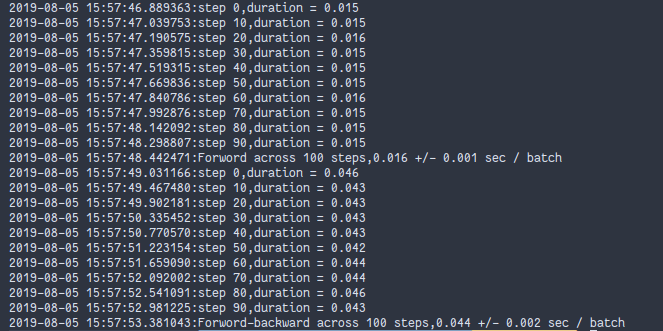

实验使用的GPU是GeForce RTX 2070。如上图，Forword的平均时间是0.016s，而Backward的平均时间是0.044s，backward的耗时是forword的三倍左右。

### 2.4 VGGNet

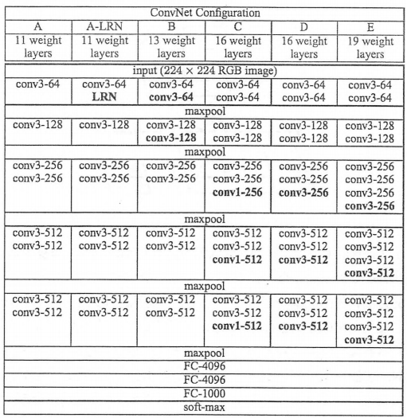

#### 2.4.1 数据准备

同AlexNet，VGGNet也使用随机生成的图片数据来测试向前传播和向后传播的速度。

随机生成图片数据：

```python
# 图片大小为224*224*3
image_size = 224
# 随机初始化图片
images = tf.Variable(
    tf.random_normal([batch_size, image_size, image_size, 3],
                     stddev=1e-1,
                     dtype=tf.float32))
```


#### 2.4.2 网络模型

```python
# VGG-16网络创建
def inference_op(input_op, keep_prob):
    # 初始化参数记录列表
    p = []
    # 第一层第一次卷积
    conv1_1 = conv_op(input_op,
                      name="conv1_1",
                      kh=3,
                      kw=3,
                      n_out=64,
                      dh=1,
                      dw=1,
                      p=p)
    # 第一层第二次卷积
    conv1_2 = conv_op(conv1_1,
                      name="conv1_2",
                      kh=3,
                      kw=3,
                      n_out=64,
                      dh=1,
                      dw=1,
                      p=p)
    # 第一层池化
    pool1 = mpool_op(conv1_2, name="pool1", kh=2, kw=2, dh=2, dw=2)

    # 第二层第一次卷积
    conv2_1 = conv_op(pool1,
                      name="conv2_1",
                      kh=3,
                      kw=3,
                      n_out=128,
                      dh=1,
                      dw=1,
                      p=p)
    # 第二层第二次卷积
    conv2_2 = conv_op(conv2_1,
                      name="conv2_1",
                      kh=3,
                      kw=3,
                      n_out=128,
                      dh=1,
                      dw=1,
                      p=p)
    # 第二层池化
    pool2 = mpool_op(conv2_2, name="pool2", kh=2, kw=2, dh=2, dw=2)

    # 第三层第一次卷积
    conv3_1 = conv_op(pool2,
                      name="conv3_1",
                      kh=3,
                      kw=3,
                      n_out=256,
                      dh=1,
                      dw=1,
                      p=p)
    # 第三层第二次卷积
    conv3_2 = conv_op(conv3_1,
                      name="conv3_2",
                      kh=3,
                      kw=3,
                      n_out=256,
                      dh=1,
                      dw=1,
                      p=p)
    # 第三层第三次卷积
    conv3_3 = conv_op(conv3_2,
                      name="conv3_3",
                      kh=3,
                      kw=3,
                      n_out=256,
                      dh=1,
                      dw=1,
                      p=p)
    # 第三层池化
    pool3 = mpool_op(conv3_3, name="pool3", kh=2, kw=2, dh=2, dw=2)

    # 第四层第一次卷积
    conv4_1 = conv_op(pool3,
                      name="conv4_1",
                      kh=3,
                      kw=3,
                      n_out=512,
                      dh=1,
                      dw=1,
                      p=p)
    # 第四层第二次卷积
    conv4_2 = conv_op(conv4_1,
                      name="conv4_2",
                      kh=3,
                      kw=3,
                      n_out=512,
                      dh=1,
                      dw=1,
                      p=p)
    # 第四层第三次卷积
    conv4_3 = conv_op(conv4_2,
                      name="conv4_3",
                      kh=3,
                      kw=3,
                      n_out=512,
                      dh=1,
                      dw=1,
                      p=p)
    # 第四层池化
    pool4 = mpool_op(conv4_3, name="pool4", kh=2, kw=2, dh=2, dw=2)

    # 第五层第一次卷积
    conv5_1 = conv_op(pool4,
                      name="conv5_1",
                      kh=3,
                      kw=3,
                      n_out=512,
                      dh=1,
                      dw=1,
                      p=p)
    # 第五层第二次卷积
    conv5_2 = conv_op(conv5_1,
                      name="conv5_2",
                      kh=3,
                      kw=3,
                      n_out=512,
                      dh=1,
                      dw=1,
                      p=p)
    # 第五层第三次卷积
    conv5_3 = conv_op(conv5_2,
                      name="con5_3",
                      kh=3,
                      kw=3,
                      n_out=512,
                      dh=1,
                      dw=1,
                      p=p)
    # 第五层池化
    pool5 = mpool_op(conv5_3, name="pool4", kh=2, kw=2, dh=2, dw=2)

    # 获取VGG-16网络处理后的数据尺寸
    shp = pool5.get_shape()
    # 计算VGG-16网络输出结果一维拉伸后的尺寸
    flattened_shape = shp[1].value * shp[2].value * shp[3].value
    # 将VGG-16网络输出张量结果一维拉伸
    resh1 = tf.reshape(pool5, [-1, flattened_shape], name="resh1")

    # 第一隐含层，4096个神经元，与输入全连接
    fc6 = fc_op(resh1, name="fc6", n_out=4096, p=p)
    # Dropout处理
    fc6_drop = tf.nn.dropout(fc6, keep_prob, name="fc6_drop")

    # 第二隐含层，4096个神经元，与上一层全连接
    fc7 = fc_op(fc6_drop, name="fc7", n_out=4096, p=p)
    # Dropout处理
    fc7_drop = tf.nn.dropout(fc7, keep_prob, name="fc7_drop")

    # 输出层，1000个神经元，与上一层全连接
    fc8 = fc_op(fc7_drop, name="fc8", n_out=1000, p=p)

    # softmax处理输出层
    softmax = tf.nn.softmax(fc8)

    # 取最大概率预测
    predictions = tf.argmax(softmax, 1)
    # 返回预测，softmax处理，输出层数据，数据记录列表
    return predictions, softmax, fc8, p

```

#### 2.4.3 实验结果

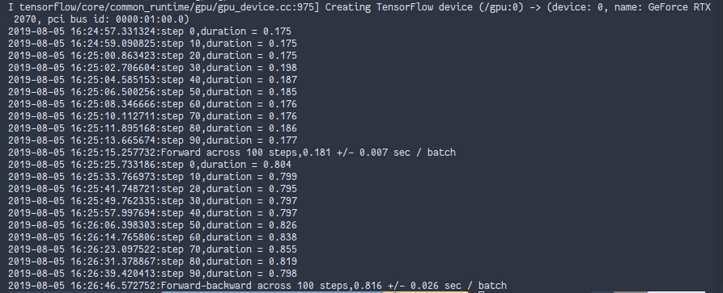

实验使用的GPU是GeForce RTX 2070。如上图，Forword的平均时间是0.181s，而Backward的平均时间是0.816s，backward的耗时是forword的三倍左右。VGGNet-16的复杂度比AlexNet要高很多，所以计算速度偏慢。

### 2.5 GoogLeNet

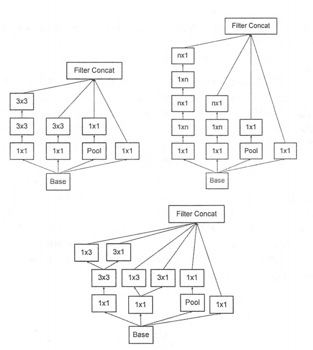

#### 2.5.1 数据准备

同AlexNet，GoogleNet也使用随机生成的图片数据来测试向前传播和向后传播的速度。

随机生成图片数据：

```python
batch_size = 32
height, width = 299, 299
inputs = tf.random_uniform((batch_size, height, width, 3))

```


#### 2.5.2 网络模型

```python
def inception_v3_base(inputs, scope=None):
    end_points = {}
    with tf.variable_scope(scope, 'InceptionV3', [inputs]):
        with slim.arg_scope([slim.conv2d, slim.max_pool2d, slim.avg_pool2d],
                            stride=1,
                            padding='VALID'):
            net = slim.conv2d(inputs,
                              32, [3, 3],
                              stride=2,
                              scope='Conv2d_1a_3x3')
            print_activations(net)

            net = slim.conv2d(net, 32, [3, 3], scope='Conv2d_2a_3x3')
            print_activations(net)

            net = slim.conv2d(net,
                              64, [3, 3],
                              padding='SAME',
                              scope='Conv2d_2b_3x3')
            print_activations(net)

            net = slim.max_pool2d(net, [3, 3],
                                  stride=2,
                                  scope='MaxPool_3a_3x3')
            print_activations(net)

            net = slim.conv2d(net, 80, [1, 1], scope='Conv2d_3b_1x1')
            print_activations(net)

            net = slim.conv2d(net, 192, [3, 3], scope='Conv2d_4a_3x3')
            print_activations(net)

            net = slim.max_pool2d(net, [3, 3],
                                  stride=2,
                                  scope='MaxPool_5a_3x3')
            print_activations(net)
            print(
                '----------------------------------------------------------------------------'
            )

        with slim.arg_scope([slim.conv2d, slim.max_pool2d, slim.avg_pool2d],
                            stride=1,
                            padding='SAME'):
            with tf.variable_scope('Mixed_5b'):
                with tf.variable_scope('Branch_0'):
                    branch_0 = slim.conv2d(net,
                                           64, [1, 1],
                                           scope='Conv2d_0a_1x1')

                with tf.variable_scope('Branch_1'):
                    branch_1 = slim.conv2d(net,
                                           48, [1, 1],
                                           scope='Conv2d_0a_1x1')
                    branch_1 = slim.conv2d(branch_1,
                                           64, [5, 5],
                                           scope='Conv2d_0b_5x5')

                with tf.variable_scope('Branch_2'):
                    branch_2 = slim.conv2d(net,
                                           64, [1, 1],
                                           scope='Conv2d_0a_1x1')
                    branch_2 = slim.conv2d(branch_2,
                                           96, [3, 3],
                                           scope='Conv2d_0b_3x3')
                    branch_2 = slim.conv2d(branch_2,
                                           96, [3, 3],
                                           scope='Conv2d_0c_3x3')

                with tf.variable_scope('Branch_3'):
                    branch_3 = slim.avg_pool2d(net, [3, 3],
                                               scope='Avgpool_0a_3x3')
                    branch_3 = slim.conv2d(branch_3,
                                           32, [1, 1],
                                           scope='Conv2d_0b_1x1')

                net = tf.concat([branch_0, branch_1, branch_2, branch_3], 3)
                print_activations(net)
                print(
                    '----------------------------------------------------------------------------'
                )

            with tf.variable_scope('Mixed_5c'):
                with tf.variable_scope('Branch_0'):
                    branch_0 = slim.conv2d(net,
                                           64, [1, 1],
                                           scope='Conv2d_0a_1x1')

                with tf.variable_scope('Branch_1'):
                    branch_1 = slim.conv2d(net,
                                           48, [1, 1],
                                           scope='Conv2d_0b_1x1')
                    branch_1 = slim.conv2d(branch_1,
                                           64, [5, 5],
                                           scope='Conv2d_0c_5x5')

                with tf.variable_scope('Branch_2'):
                    branch_2 = slim.conv2d(net,
                                           64, [1, 1],
                                           scope='Conv2d_0a_1x1')
                    branch_2 = slim.conv2d(branch_2,
                                           96, [3, 3],
                                           scope='Conv2d_0b_3x3')
                    branch_2 = slim.conv2d(branch_2,
                                           96, [3, 3],
                                           scope='Conv2d_0c_3x3')

                with tf.variable_scope('Branch_3'):
                    branch_3 = slim.avg_pool2d(net, [3, 3],
                                               scope='Avgpool_0a_3x3')
                    branch_3 = slim.conv2d(branch_3,
                                           64, [1, 1],
                                           scope='Conv2d_0b_1x1')

                net = tf.concat([branch_0, branch_1, branch_2, branch_3], 3)
                print_activations(net)
                print(
                    '----------------------------------------------------------------------------'
                )

            with tf.variable_scope('Mixed_5d'):
                with tf.variable_scope('Branch_0'):
                    branch_0 = slim.conv2d(net,
                                           64, [1, 1],
                                           scope='Conv2d_0a_1x1')

                with tf.variable_scope('Branch_1'):
                    branch_1 = slim.conv2d(net,
                                           48, [1, 1],
                                           scope='Conv2d_0a_1x1')
                    branch_1 = slim.conv2d(branch_1,
                                           64, [5, 5],
                                           scope='Conv2d_0b_5x5')

                with tf.variable_scope('Branch_2'):
                    branch_2 = slim.conv2d(net,
                                           64, [1, 1],
                                           scope='Conv2d_0a_1x1')
                    branch_2 = slim.conv2d(branch_2,
                                           96, [3, 3],
                                           scope='Conv2d_0b_3x3')
                    branch_2 = slim.conv2d(branch_2,
                                           96, [3, 3],
                                           scope='Conv2d_0c_3x3')

                with tf.variable_scope('Branch_3'):
                    branch_3 = slim.avg_pool2d(net, [3, 3],
                                               scope='Avgpool_0a_3x3')
                    branch_3 = slim.conv2d(branch_3,
                                           64, [1, 1],
                                           scope='Conv2d_0b_1x1')

                net = tf.concat([branch_0, branch_1, branch_2, branch_3], 3)
                print_activations(net)
                print(
                    '----------------------------------------------------------------------------'
                )

            with tf.variable_scope('Mixed_6a'):
                print_activations(net)
                with tf.variable_scope('Branch_0'):
                    branch_0 = slim.conv2d(net,
                                           384, [3, 3],
                                           stride=2,
                                           padding='VALID',
                                           scope='Conv2d_1a_1x1')

                with tf.variable_scope('Branch_1'):
                    branch_1 = slim.conv2d(net,
                                           64, [1, 1],
                                           scope='Conv2d_0a_1x1')
                    branch_1 = slim.conv2d(branch_1,
                                           96, [3, 3],
                                           scope='Conv2d_0b_3x3')
                    branch_1 = slim.conv2d(branch_1,
                                           96, [3, 3],
                                           stride=2,
                                           padding='VALID',
                                           scope='Conv2d_1a_3x3')

                with tf.variable_scope('Branch_2'):
                    branch_2 = slim.max_pool2d(net, [3, 3],
                                               stride=2,
                                               padding='VALID',
                                               scope='MaxPool_1a_3x3')

                net = tf.concat([branch_0, branch_1, branch_2], 3)
                print_activations(net)
                print(
                    '----------------------------------------------------------------------------'
                )

            with tf.variable_scope('Mixed_6b'):
                with tf.variable_scope('Branch_0'):
                    branch_0 = slim.conv2d(net,
                                           192, [1, 1],
                                           scope='Conv2d_0a_1x1')

                with tf.variable_scope('Branch_1'):
                    branch_1 = slim.conv2d(net,
                                           128, [1, 1],
                                           scope='Conv2d_0a_1x1')
                    branch_1 = slim.conv2d(branch_1,
                                           128, [1, 7],
                                           scope='Conv2d_0b_1x7')
                    branch_1 = slim.conv2d(branch_1,
                                           192, [7, 1],
                                           scope='Conv2d_0c_7x1')

                with tf.variable_scope('Branch_2'):
                    branch_2 = slim.conv2d(net,
                                           128, [1, 1],
                                           scope='Conv2d_0a_1x1')
                    branch_2 = slim.conv2d(branch_2,
                                           128, [7, 1],
                                           scope='Conv2d_0b_7x1')
                    branch_2 = slim.conv2d(branch_2,
                                           128, [1, 7],
                                           scope='Conv2d_0c_1x7')
                    branch_2 = slim.conv2d(branch_2,
                                           128, [7, 1],
                                           scope='Conv2d_0d_7x1')
                    branch_2 = slim.conv2d(branch_2,
                                           192, [1, 7],
                                           scope='Conv2d_0e_1x7')

                with tf.variable_scope('Branch_3'):
                    branch_3 = slim.avg_pool2d(net, [3, 3],
                                               scope='Avgpool_0a_3x3')
                    branch_3 = slim.conv2d(branch_3,
                                           192, [1, 1],
                                           scope='Conv2d_0b_1x1')

                net = tf.concat([branch_0, branch_1, branch_2, branch_3], 3)
                print_activations(net)

            with tf.variable_scope('Mixed_6c'):
                with tf.variable_scope('Branch_0'):
                    branch_0 = slim.conv2d(net,
                                           192, [1, 1],
                                           scope='Conv2d_0a_1x1')

                with tf.variable_scope('Branch_1'):
                    branch_1 = slim.conv2d(net,
                                           160, [1, 1],
                                           scope='Conv2d_0a_1x1')
                    branch_1 = slim.conv2d(branch_1,
                                           160, [1, 7],
                                           scope='Conv2d_0b_1x7')
                    branch_1 = slim.conv2d(branch_1,
                                           192, [7, 1],
                                           scope='Conv2d_0c_7x1')

                with tf.variable_scope('Branch_2'):
                    branch_2 = slim.conv2d(net,
                                           160, [1, 1],
                                           scope='Conv2d_0a_1x1')
                    branch_2 = slim.conv2d(branch_2,
                                           160, [7, 1],
                                           scope='Conv2d_0b_7x1')
                    branch_2 = slim.conv2d(branch_2,
                                           160, [1, 7],
                                           scope='Conv2d_0c_1x7')
                    branch_2 = slim.conv2d(branch_2,
                                           160, [7, 1],
                                           scope='Conv2d_0d_7x1')
                    branch_2 = slim.conv2d(branch_2,
                                           192, [1, 7],
                                           scope='Conv2d_0e_1x7')

                with tf.variable_scope('Branch_3'):
                    branch_3 = slim.avg_pool2d(net, [3, 3],
                                               scope='Avgpool_0a_3x3')
                    branch_3 = slim.conv2d(branch_3,
                                           192, [1, 1],
                                           scope='Conv2d_0b_1x1')

                net = tf.concat([branch_0, branch_1, branch_2, branch_3], 3)
                print_activations(net)

            with tf.variable_scope('Mixed_6d'):
                with tf.variable_scope('Branch_0'):
                    branch_0 = slim.conv2d(net,
                                           192, [1, 1],
                                           scope='Conv2d_0a_1x1')

                with tf.variable_scope('Branch_1'):
                    branch_1 = slim.conv2d(net,
                                           160, [1, 1],
                                           scope='Conv2d_0a_1x1')
                    branch_1 = slim.conv2d(branch_1,
                                           160, [1, 7],
                                           scope='Conv2d_0b_1x7')
                    branch_1 = slim.conv2d(branch_1,
                                           192, [7, 1],
                                           scope='Conv2d_0c_7x1')

                with tf.variable_scope('Branch_2'):
                    branch_2 = slim.conv2d(net,
                                           160, [1, 1],
                                           scope='Conv2d_0a_1x1')
                    branch_2 = slim.conv2d(branch_2,
                                           160, [7, 1],
                                           scope='Conv2d_0b_7x1')
                    branch_2 = slim.conv2d(branch_2,
                                           160, [1, 7],
                                           scope='Conv2d_0c_1x7')
                    branch_2 = slim.conv2d(branch_2,
                                           160, [7, 1],
                                           scope='Conv2d_0d_7x1')
                    branch_2 = slim.conv2d(branch_2,
                                           192, [1, 7],
                                           scope='Conv2d_0e_1x7')

                with tf.variable_scope('Branch_3'):
                    branch_3 = slim.avg_pool2d(net, [3, 3],
                                               scope='Avgpool_0a_3x3')
                    branch_3 = slim.conv2d(branch_3,
                                           192, [1, 1],
                                           scope='Conv2d_0b_1x1')

                net = tf.concat([branch_0, branch_1, branch_2, branch_3], 3)
                print_activations(net)

            with tf.variable_scope('Mixed_6e'):
                with tf.variable_scope('Branch_0'):
                    branch_0 = slim.conv2d(net,
                                           192, [1, 1],
                                           scope='Conv2d_0a_1x1')

                with tf.variable_scope('Branch_1'):
                    branch_1 = slim.conv2d(net,
                                           192, [1, 1],
                                           scope='Conv2d_0a_1x1')
                    branch_1 = slim.conv2d(branch_1,
                                           192, [1, 7],
                                           scope='Conv2d_0b_1x7')
                    branch_1 = slim.conv2d(branch_1,
                                           192, [7, 1],
                                           scope='Conv2d_0c_7x1')

                with tf.variable_scope('Branch_2'):
                    branch_2 = slim.conv2d(net,
                                           192, [1, 1],
                                           scope='Conv2d_0a_1x1')
                    branch_2 = slim.conv2d(branch_2,
                                           192, [7, 1],
                                           scope='Conv2d_0b_7x1')
                    branch_2 = slim.conv2d(branch_2,
                                           192, [1, 7],
                                           scope='Conv2d_0c_1x7')
                    branch_2 = slim.conv2d(branch_2,
                                           192, [7, 1],
                                           scope='Conv2d_0d_7x1')
                    branch_2 = slim.conv2d(branch_2,
                                           192, [1, 7],
                                           scope='Conv2d_0e_1x7')

                with tf.variable_scope('Branch_3'):
                    branch_3 = slim.avg_pool2d(net, [3, 3],
                                               scope='Avgpool_0a_3x3')
                    branch_3 = slim.conv2d(branch_3,
                                           192, [1, 1],
                                           scope='Conv2d_0b_1x1')

                net = tf.concat([branch_0, branch_1, branch_2, branch_3], 3)
                end_points['Mixed_6e'] = net
                print_activations(net)

            with tf.variable_scope('Mixed_7a'):
                with tf.variable_scope('Branch_0'):
                    branch_0 = slim.conv2d(net,
                                           192, [1, 1],
                                           scope='Conv2d_0a_1x1')
                    branch_0 = slim.conv2d(branch_0,
                                           320, [3, 3],
                                           stride=2,
                                           padding='VALID',
                                           scope='Conv2d_1a_1x1')

                with tf.variable_scope('Branch_1'):
                    branch_1 = slim.conv2d(net,
                                           192, [1, 1],
                                           scope='Conv2d_0a_1x1')
                    branch_1 = slim.conv2d(branch_1,
                                           192, [1, 7],
                                           scope='Conv2d_0b_1x7')
                    branch_1 = slim.conv2d(branch_1,
                                           192, [7, 1],
                                           scope='Conv2d_0c_7x1')
                    branch_1 = slim.conv2d(branch_1,
                                           192, [3, 3],
                                           stride=2,
                                           padding='VALID',
                                           scope='Conv2d_1a_3x3')

                with tf.variable_scope('Branch_2'):
                    branch_2 = slim.max_pool2d(net, [3, 3],
                                               stride=2,
                                               padding='VALID',
                                               scope='MaxPool_1a_3x3')

                net = tf.concat([branch_0, branch_1, branch_2], 3)
                print_activations(net)

            with tf.variable_scope('Mixed_7b'):
                with tf.variable_scope('Branch_0'):
                    branch_0 = slim.conv2d(net,
                                           320, [1, 1],
                                           scope='Conv2d_0a_1x1')

                with tf.variable_scope('Branch_1'):
                    branch_1 = slim.conv2d(net,
                                           384, [1, 1],
                                           scope='Conv2d_0a_1x1')
                    branch_1 = tf.concat([
                        slim.conv2d(
                            branch_1, 384, [1, 3], scope='Conv2d_0b_1x3'),
                        slim.conv2d(
                            branch_1, 384, [3, 1], scope='Conv2d_0b_3x1')
                    ], 3)

                with tf.variable_scope('Branch_2'):
                    branch_2 = slim.conv2d(net,
                                           448, [1, 1],
                                           scope='Conv2d_0a_1x1')
                    branch_2 = slim.conv2d(branch_2,
                                           384, [3, 3],
                                           scope='Conv2d_0b_7x1')

                    branch_2 = tf.concat([
                        slim.conv2d(
                            branch_2, 384, [1, 3], scope='Conv2d_0c_1x3'),
                        slim.conv2d(
                            branch_2, 384, [3, 1], scope='Conv2d_0d_3x1')
                    ], 3)
                with tf.variable_scope('Branch_3'):
                    branch_3 = slim.avg_pool2d(net, [3, 3],
                                               scope='Avgpool_0a_3x3')
                    branch_3 = slim.conv2d(branch_3,
                                           192, [1, 1],
                                           scope='Conv2d_0b_1x1')

                net = tf.concat([branch_0, branch_1, branch_2, branch_3], 3)
                print_activations(net)

            with tf.variable_scope('Mixed_7c'):
                with tf.variable_scope('Branch_0'):
                    branch_0 = slim.conv2d(net,
                                           320, [1, 1],
                                           scope='Conv2d_0a_1x1')

                with tf.variable_scope('Branch_1'):
                    branch_1 = slim.conv2d(net,
                                           384, [1, 1],
                                           scope='Conv2d_0a_1x1')
                    branch_1 = tf.concat([
                        slim.conv2d(
                            branch_1, 384, [1, 3], scope='Conv2d_0b_1x3'),
                        slim.conv2d(
                            branch_1, 384, [3, 1], scope='Conv2d_0c_3x1')
                    ], 3)

                with tf.variable_scope('Branch_2'):
                    branch_2 = slim.conv2d(net,
                                           448, [1, 1],
                                           scope='Conv2d_0a_1x1')
                    branch_2 = slim.conv2d(branch_2,
                                           384, [3, 3],
                                           scope='Conv2d_0b_7x1')

                    branch_2 = tf.concat([
                        slim.conv2d(
                            branch_2, 384, [1, 3], scope='Conv2d_0c_1x3'),
                        slim.conv2d(
                            branch_2, 384, [3, 1], scope='Conv2d_0d_3x1')
                    ], 3)
                with tf.variable_scope('Branch_3'):
                    branch_3 = slim.avg_pool2d(net, [3, 3],
                                               scope='Avgpool_0a_3x3')
                    branch_3 = slim.conv2d(branch_3,
                                           192, [1, 1],
                                           scope='Conv2d_0b_1x1')

                net = tf.concat([branch_0, branch_1, branch_2, branch_3], 3)
                print_activations(net)

    return net, end_points


def inception_v3(inputs,
                 num_classes=1000,
                 is_training=True,
                 dropout_keep_prob=0.8,
                 prediction_fn=slim.softmax,
                 spatial_squeeze=True,
                 reuse=None,
                 scope='InceptionV3'):
    with tf.variable_scope(scope,
                           'InceptionV3', [inputs, num_classes],
                           reuse=reuse) as scope:
        with slim.arg_scope([slim.batch_norm, slim.dropout],
                            is_training=is_training):
            net, end_points = inception_v3_base(inputs, scope=scope)

        with slim.arg_scope([slim.conv2d, slim.max_pool2d, slim.avg_pool2d],
                            stride=1,
                            padding='SAME'):
            aux_logits = end_points['Mixed_6e']
            with tf.variable_scope('AuxLogits'):
                aux_logits = slim.avg_pool2d(aux_logits, [5, 5],
                                             stride=3,
                                             padding='VALID',
                                             scope='AvgPool_1a_5x5')
                aux_logits = slim.conv2d(aux_logits,
                                         128, [1, 1],
                                         scope='Conv2d_1b_1x1')

                aux_logits = slim.conv2d(
                    aux_logits,
                    768, [5, 5],
                    weights_initializer=trunc_normal(0.01),
                    padding='VALID',
                    scope='Conv2d_2a_5x5')

                aux_logits = slim.conv2d(
                    aux_logits,
                    num_classes, [1, 1],
                    activation_fn=None,
                    normalizer_fn=None,
                    weights_initializer=trunc_normal(0.001),
                    scope='Conv2d_2b_5x5')
                if spatial_squeeze:
                    aux_logits = tf.squeeze(aux_logits, [1, 2],
                                            name='SpatialSqueeze')
                    end_points['AuxLogits'] = aux_logits
    with tf.variable_scope('Logits'):
        net = slim.avg_pool2d(net, [8, 8],
                              padding='VALID',
                              scope='AvgPool_1a_8x8')
        net = slim.dropout(net,
                           keep_prob=dropout_keep_prob,
                           scope='Dropout_1b')
        end_points['PreLogits'] = net
        logits = slim.conv2d(net,
                             num_classes, [1, 1],
                             activation_fn=None,
                             normalizer_fn=None,
                             scope='Conv2d_1c_1x1')
        if spatial_squeeze:
            logits = tf.squeeze(logits, [1, 2], name='SpatialSqueeze')
            end_points['logits'] = logits
            end_points['Predictions'] = prediction_fn(logits,
                                                      scope='Predictions')
        return logits, end_points

```

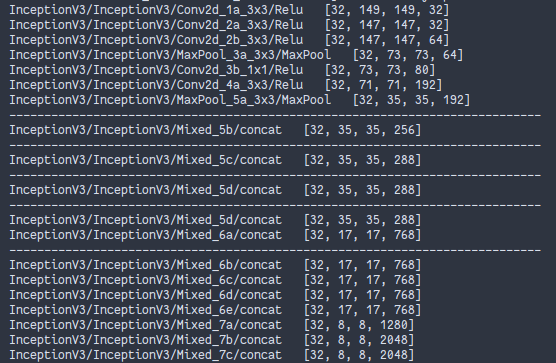

#### 2.5.3 实验结果

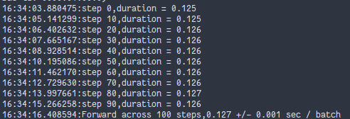

实验使用的GPU是GeForce RTX 2070。如上图，Forword的平均时间是0.127s。在图像比VGGNet-16大的情况下速度比VGGNet-16快，因为GoogleNet的参数相对较少。

### 2.6 Resnet

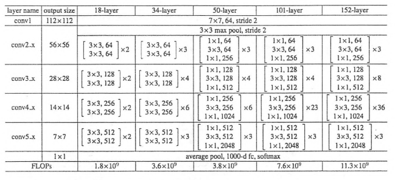

#### 2.6.1 数据准备

同AlexNet，Resnet也使用随机生成的图片数据来测试向前传播和向后传播的速度。

随机生成图片数据：

```python
batch_size = 32
height, width = 224, 224
inputs = tf.random_uniform((batch_size, height, width, 3))

```


#### 2.6.2 网络模型

Resnet152：

```python
# resnet模型
def resnet_v2(inputs,
              blocks,
              num_classes=None,
              global_pool=True,
              include_root_block=True,
              reuse=None,
              scope=None):
    with tf.variable_scope(scope, 'resnet_v2', [inputs], reuse=reuse) as sc:
        end_points_collection = sc.original_name_scope + '_end_points'
        with slim.arg_scope([slim.conv2d, bottleneck, stack_blocks_dense],
                            outputs_collections=end_points_collection):
            net = inputs
            if include_root_block:
                with slim.arg_scope([slim.conv2d],
                                    activation_fn=None,
                                    normalizer_fn=None):
                    net = conv2d_same(net, 64, 7, stride=2, scope='conv1')
                net = slim.max_pool2d(net, [3, 3], stride=2, scope='pool1')
            net = stack_blocks_dense(net, blocks)

            net = slim.batch_norm(net,
                                  activation_fn=tf.nn.relu,
                                  scope='postnorm')
            if global_pool:
                # Global average pooling.
                net = tf.reduce_mean(net, [1, 2], name='pool5', keep_dims=True)
            if num_classes is not None:
                net = slim.conv2d(net,
                                  num_classes, [1, 1],
                                  activation_fn=None,
                                  normalizer_fn=None,
                                  scope='logits')

            end_points = slim.utils.convert_collection_to_dict(
                end_points_collection)
            if num_classes is not None:
                end_points['predictions'] = slim.softmax(net,
                                                         scope='predictions')
            return net, end_points


# resnet152模型
def resnet_v2_152(inputs,
                  num_classes=None,
                  global_pool=True,
                  reuse=None,
                  scope='resnet_v2_152'):
    blocks = [
        Block('block1', bottleneck, [(256, 64, 1)] * 2 + [(256, 64, 2)]),
        Block('block2', bottleneck, [(512, 128, 1)] * 7 + [(512, 128, 2)]),
        Block('block3', bottleneck, [(1024, 256, 1)] * 35 + [(1024, 256, 2)]),
        Block('block4', bottleneck, [(2048, 512, 1)] * 3)
    ]
    return resnet_v2(inputs,
                     blocks,
                     num_classes,
                     global_pool,
                     include_root_block=True,
                     reuse=reuse,
                     scope=scope)

```

#### 2.6.3 实验结果

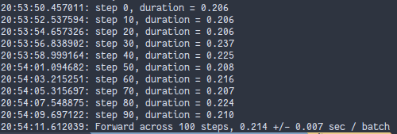

实验使用的GPU是GeForce RTX 2070。如上图，Forword的平均时间是0.214s。该网络层数高达152层，但是速度却没有那么慢，并且准确率相较之前的网络，会有很大的提升。Resnet的出现解决了梯度爆炸的问题，取得了很好的效果。ResNet可以算是深度学习中的一个里程碑式的突破。

### 2.7 LSTM

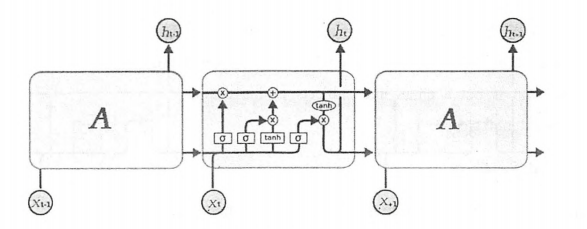

#### 2.7.1 数据准备

实验使用Penn Tree Bank（PTB）数据集。

下载并解压数据集：

```shell
wget http://www.fit.vutbr.cz/~imikolov/rnnlm/simple-examples.tgz
tar xvf simple-examples.tgz

```

下载TensorFlow Models库 `git clone https://github.com/tensorflow/models.git`

将models/tutorials/rnn/ptb中的reader.py复制到lstm.py、simple-examples.tgz相同的文件夹内

#### 2.6.2 网络模型

```python
class PTBModel(object):
    """语言模型类"""

    # is_training:训练标记、config:配置参数、input_:输入实例
    def __init__(self, is_training, config, input_):
        # 读取输入input
        self._input = input_
        # 读取batch size
        batch_size = input_.batch_size
        # 读取num steps
        num_steps = input_.num_steps
        # config两个参数读取到本地变量
        size = config.hidden_size
        vocab_size = config.vocab_size

        # 使用BasicLSTMCell设置默认LSTM单元
        def lstm_cell():
            # 隐藏节点为之前的hidden size，forget bias初始化为0，state is truple选择True接受和返回2-tuple
            return tf.contrib.rnn.BasicLSTMCell(size,
                                                forget_bias=0.0,
                                                state_is_tuple=True)

        attn_cell = lstm_cell
        # 训练状态下，keep prod小于1，则在lstm cell前接一个dropout层
        if is_training and config.keep_prob < 1:
            # 调用DropoutWrapper
            def attn_cell():
                return tf.contrib.rnn.DropoutWrapper(
                    lstm_cell(), output_keep_prob=config.keep_prob)

        # 使用RNN堆叠函数MultiRNNCell将前面多层的lstm cell堆叠到cell，堆叠次数num layers
        cell = tf.contrib.rnn.MultiRNNCell(
            [attn_cell() for _ in range(config.num_layers)],
            state_is_tuple=True)
        # 设置LSTM单元初始化状态为0
        self._initial_state = cell.zero_state(batch_size, tf.float32)

        # 创建网络词嵌入embedding部分，将onthot单词转化为向量形式
        # 限定使用cpu运行
        with tf.device("/cpu:0"):
            # 初始化embedding矩阵，词汇表数vocab_size，列数hidden size和之前的LSTM隐层节点数一致
            embedding = tf.get_variable("embedding", [vocab_size, size],
                                        dtype=tf.float32)
            # embedding_lookup函数查询单词对应的向量表达获得input
            inputs = tf.nn.embedding_lookup(embedding, input_.input_data)

        # 训练状态下，再添加一层dropout
        if is_training and config.keep_prob < 1:
            inputs = tf.nn.dropout(inputs, config.keep_prob)

        # 定义输出outputs
        outputs = []
        state = self._initial_state
        # variable_scope接下来的操作名称设为RNN
        with tf.variable_scope("RNN"):
            # num steps限制梯度在方向传播时可以展开的步数
            for time_step in range(num_steps):
                # 从第二次循环开始，get_variable_scope().reuse_variables()设置复用变量
                if time_step > 0:
                    tf.get_variable_scope().reuse_variables()
                # 每次循环，传入inputs和state到堆叠的LSTM
                # input三个维度：batch中第几个样本，样本中第几个单词，单词的向量表达的维度
                (cell_output, state) = cell(inputs[:, time_step, :], state)
                # 将结果添加到输出列表
                outputs.append(cell_output)

        # 将output内容串到一起，使用reshape转化为一维向量
        output = tf.reshape(tf.concat(outputs, 1), [-1, size])
        # 构建softmax层
        # 权重W
        softmax_w = tf.get_variable("softmax_w", [size, vocab_size],
                                    dtype=tf.float32)
        # 偏置b
        softmax_b = tf.get_variable("softmax_b", [vocab_size],
                                    dtype=tf.float32)
        # 结果得到logits获得网络输出
        logits = tf.matmul(output, softmax_w) + softmax_b
        # 定义损失函数loss，计算logits和targets偏差，并汇总误差
        loss = tf.contrib.legacy_seq2seq.sequence_loss_by_example(
            [logits], [tf.reshape(input_.targets, [-1])],
            [tf.ones([batch_size * num_steps], dtype=tf.float32)])
        # 计算每个样本平均误差
        self._cost = cost = tf.reduce_sum(loss) / batch_size
        # 保留最终的状态
        self._final_state = state

        # 如果不是训练，就直接返回
        if not is_training:
            return

        # 定义学习率lr
        self._lr = tf.Variable(0.0, trainable=False)
        # 获取全部参数
        tvars = tf.trainable_variables()
        # 针对前面的cost，计算tvars梯度
        grads, _ = tf.clip_by_global_norm(tf.gradients(cost, tvars),
                                          config.max_grad_norm)
        # 梯度下降算法优化器
        optimizer = tf.train.GradientDescentOptimizer(self._lr)
        # 再创建训练操作
        self._train_op = optimizer.apply_gradients(
            zip(grads, tvars),
            global_step=tf.contrib.framework.get_or_create_global_step())

        # 设置new lr用来控制学习速率
        self._new_lr = tf.placeholder(tf.float32,
                                      shape=[],
                                      name="new_learning_rate")
        # 同时定义学习率更新操作lr update
        self._lr_update = tf.assign(self._lr, self._new_lr)

    # 设置lr函数
    def assign_lr(self, session, lr_value):
        session.run(self._lr_update, feed_dict={self._new_lr: lr_value})

```

#### 2.7.3 实验结果

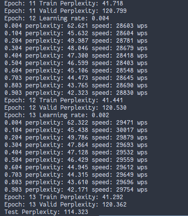

实验使用的GPU是GeForce RTX 2070。如上图，训练的速度可以达到30000单词每秒，同时在最后一个epoch中，训练集上可达41.29的perplexity，验证集和测试集上也可以达到120.362和114.323的perplexity。